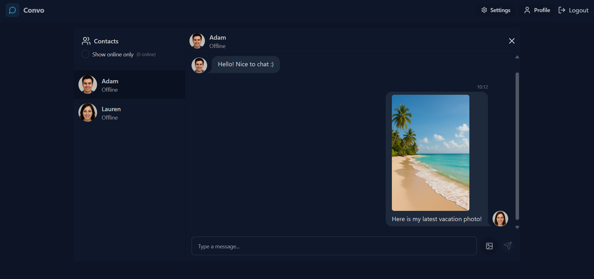

# Convo — Real-Time Chat App (Full-Stack / Production-Ready)



Convo is a fully deployed, production-ready **real-time messaging platform** built to demonstrate strong full‑stack engineering capability.  
It showcases **authentication, sockets, state management, file uploads, theme systems, UI/UX polish, and cloud deployment**—the exact skillset recruiters look for in modern full‑stack roles.

---

# Project Details

### ✔ End‑to‑end architecture  
Frontend (React + Vite) ↔ Backend (Node + Express) ↔ Database (MongoDB) ↔ WebSockets (Socket.IO)

### ✔ Production-grade deployment  
- **Netlify** (frontend)  
- **Render** (backend)  
- Cross‑domain cookies  
- Environment‑specific CORS  
- WebSocket transport stability  

### ✔ Real application features  
- Auth, profile management, image upload  
- Real-time messaging  
- State persistence  
- Cloud-hosted media  
- Theme system  
- Mobile-ready UI  

This is a complete demonstration of **frontend, backend, DevOps, security, UX, and real‑world problem solving**.

---

# 🚀 Live Demo
Frontend: **https://full-stack-chat.netlify.app/**  
Backend: **https://full-stack-chat-app-rm9v.onrender.com/**

---

# 🔥 Key Features

### **Authentication**
- Secure JWT auth using httpOnly cookies  
- Cross-site cookie configuration (Netlify ↔ Render)  
- Protected routes via middleware  

### **Real-Time Chat**
- Message send/receive with Socket.IO  
- Online/offline user indicators  
- Auto-scroll, message timestamps  
- Persisted message history in MongoDB  

### **User Profiles**
- Cloudinary image uploads  
- Profile editing  
- **Delete Profile** (removes account + all messages)  
- Built specifically so recruiters can test and reset easily  

### **Clean Modern UI**
- Improved homepage layout  
- New branding (“Convo”)  
- Custom favicon + hero  
- Theme system with 20+ selectable styles  
- Live theme preview with no reload  

### **Robust Architecture**
- Separated frontend + backend  
- API layer with axios + credentials  
- Secure cookie-based auth across domains  
- Socket.IO namespace + event handling  
- Responsive design ready for mobile  

---

# 🧩 Tech Stack

### **Frontend**
- React 18 (Vite)
- Zustand (global state)
- TailwindCSS + DaisyUI
- Socket.IO client
- React Router
- Netlify

### **Backend**
- Node.js
- Express
- MongoDB Atlas (Mongoose)
- Socket.IO real-time server
- Cloudinary
- Render (deploy)

---

# 🗂 Project Structure

```
root/
│
├── backend/
│   ├── controllers/
│   ├── middleware/
│   ├── models/
│   ├── routes/
│   └── index.js
│
├── frontend/
│   ├── src/
│   │   ├── components/
│   │   ├── pages/
│   │   ├── store/
│   │   └── main.jsx
│   └── public/
│
└── README.md
```

---

# 🔧 Installation

### Clone repo
```sh
git clone https://github.com/YOUR-USERNAME/full-stack-chat-app.git
cd full-stack-chat-app
```

### Frontend setup
```sh
cd frontend
npm install
npm run dev
```

### Backend setup
```sh
cd backend
npm install
npm run dev
```

---

# 🔐 Environment Variables

### **Frontend (Netlify)**
```
VITE_API_URL=https://<your-render-backend-url>
```

### **Backend (Render)**
```
MONGO_URI=
JWT_SECRET=
CLOUDINARY_CLOUD_NAME=
CLOUDINARY_API_KEY=
CLOUDINARY_API_SECRET=
CLIENT_URL=https://<your-netlify-url>
```

---

# 🌩 Deployment Notes

### **Frontend (Netlify)**
Includes SPA redirect support:
```
/* /index.html 200
```

### **Backend (Render)**
- Enables WebSockets  
- Uses secure cookies (`sameSite=none`, `secure=true`)  
- CORS preconfigured for Netlify  

---

# 🗑 Delete Profile Feature

Built specifically so **recruiters can safely test the app** without creating permanent accounts.

Deleting a profile:
- Removes user from MongoDB  
- Deletes all messages sent or received  
- Clears login cookie  
- Redirects to signup  

---

# 📸 Screenshots

### Dashboard  
See hero image at top of this README.

---

# 🤝 Contributing
Contributions are welcome.  
Open an issue or submit a pull request.

---

# 📄 License
MIT License  

---

# ⭐ If you’d like to support this project
Star the repo—it helps visibility and shows your support!
